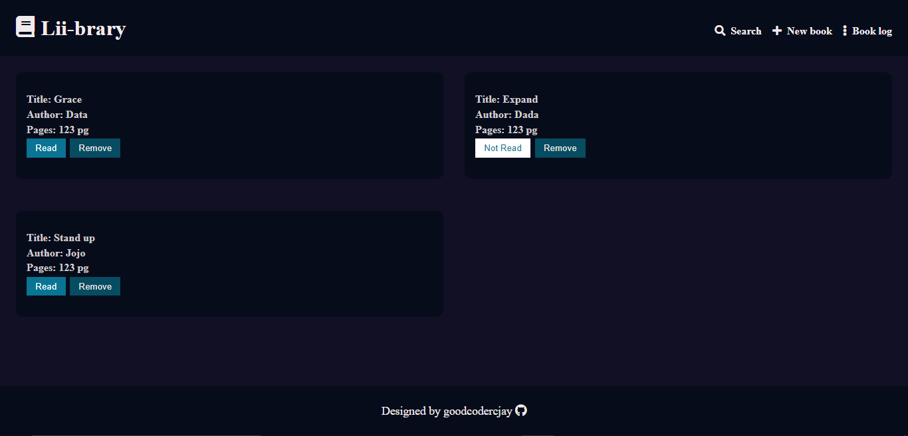

# **Creating a simple book library**

In this project I tried to create a simple **CRUD** web interface to collect user's info on books wished to read or must have read in order to have its info saved.

### **Issues encountered**

1. While trying to push **class** instance to the array of library I created, I discovered that rendering the markup brings up the previous sibling of the next sibling to the parent twice.
   _This was solved by removing the child of the next sibling to the parent_

2. Creating the function for searching items was n't working because I was tring to return the container of the book info.
   _Solved this by asking for help through google and was able see why my filter wasn't rendering the supposed item._

#### **Knowledge gained**

Can comfortably use the web local storage API
